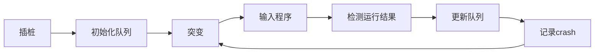
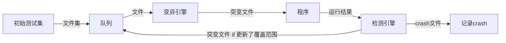

模糊测试 （fuzz testing, fuzzing）是一种软件测试技术。其核心思想是自动或半自动的生成随机数据输入到一个程序中，并监视程序异常，如崩溃，断言(assertion)失败，以发现可能的程序错误，比如内存泄漏。模糊测试常常用于检测软件或计算机系统的安全漏洞。

<!--more-->

## Fuzzing原理

黑盒测试是一种检验程序功能是否可以正常使用的测试方法。它将程序模块看作是一个**不能打开的黑盒**，**忽略程序模块的内部逻辑结构**，对程序**接口**进行测试，检查程序能否正常的接受输入数据并产生正确的输出。

**灰盒**模糊测试也是越来越流行的检测方式之一，它利用**检测**而不是程序分析来收集有关程序的信息。例如在程序中进行**插桩**，可以获得一条fuzzing用例在执行时对应的代码覆盖率。如果接触到了更多的程序内容，它就把这一条用例记录下来，用于改进fuzzing的效果。

Fuzzing技术是一种基于**黑盒（或灰盒）**的测试技术，通过**自动化生成**并执行大量的随机测试用例来发现产品或协议的未知漏洞。

对于复杂的程序，输入用例的数量极大，不可能对其进行穷举，只能对部分可能的异常情景进行测试。然而人脑难以考虑到所有异常情景的组合，Fuzzing的出现就是为了解决这个问题。Fuzzing技术本质是依靠**随机函数生成随机测试用例**来进行测试验证。

## Fuzzing的基本算法

Fuzzing引擎算法中，测试用例的生成方式主要有2种：

1. 基于变异：根据已知数据样本通过变异的方法生成新的测试用例；

2. 基于生成：根据已知的协议或接口规范进行建模，生成测试用例；

一般Fuzzing工具中，都会综合使用这两种生成方式，不同的Fuzzer的用例生成方式有所不同。

这两种算法只是一般Fuzzing生成测试用例的算法的基本思想，在此之上实现的算法有太多了。

## Fuzzer的工作流程

Fuzzer需要通过策略不断生成随机数据并将其输入给程序，并检查程序是否有`crash`，之后根据结果优化生成策略，循环上述步骤持续地进行Fuzzing。

上述步骤只是一个极简的Fuzzer工作流程，对不同的Fuzzer工作流程可能会有一些差别，但也可从中看出，其中最重要的就是**生成随机数据的部分**。

部分Fuzzer还用到了灰盒测试的技术，在程序之中**插桩**来**检测生成用例的代码覆盖率**。

### AFL++的工作流程

AFL++是 Google 的 AFL 的一个分支，是一个基于突变的Fuzzer，通过遗传算法生成新的随机数据。

1. 从源码编译程序时进行插桩，以记录代码覆盖率（Code Coverage）；
2. 选择一些输入文件，作为初始测试集加入输入队列（queue）；
3. 将队列中的文件按一定的策略进行“突变”；
4. 如果经过变异文件更新了覆盖范围，则将其保留添加到队列中;
5. 上述过程会一直循环进行，期间触发了crash的文件会被记录下来

**执行流：**

**数据流：**

对AFL++而言，生成随机数据的部分，即**变异引擎**是最重要的部分。

## Fuzzer的结构

先从最简单的Fuzzer开始：

- 变异引擎：用于根据原有的文件产生新的文件（一般以数据的形式进行变异）
- 控制模块：
    - 存储Fuzzer的重要参数
    - 控制Fuzzer不断工作
        - 给程序输入数据
        - 判断程序接受输入后的结果
        - 根据运行结果执行不同的操作
    - 显示Fuzzer的运行状态

这应该是最基本的Fuzzer结构。

当然在此基础之上有许多值得优化的部分：

- 引入灰盒测试思想（插桩之类的技术）
- **变异引擎的变异策略（最重要的）**
- 结合**生成式**的策略
- 对`crash`的区分和描述
- ...

## Fuzzer性能的衡量标准

要判断对Fuzzer的改进是否有效，我们需要知道怎样的Fuzzer是一个好的Fuzzer，这需要一些指标去评价一个Fuzzer。

- 一次fuzzing所需时间
- `crash`产生的速率
- 路径覆盖率
- 覆盖率粒度
- ...

