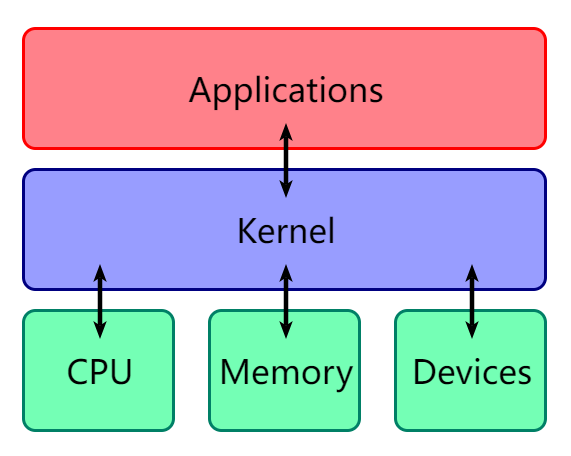
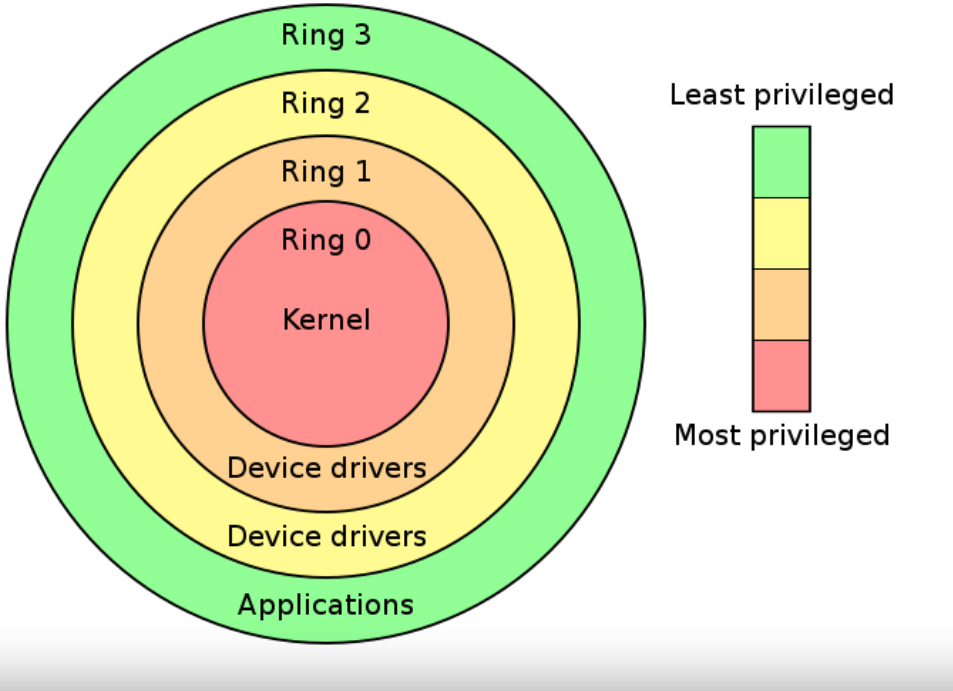
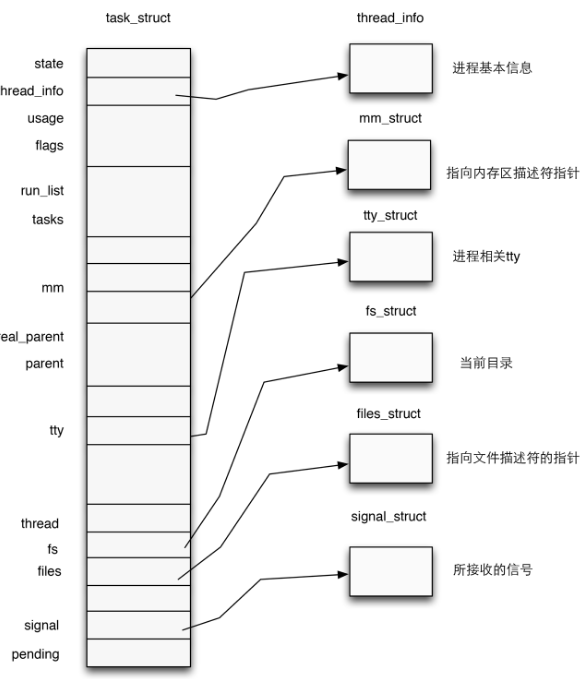
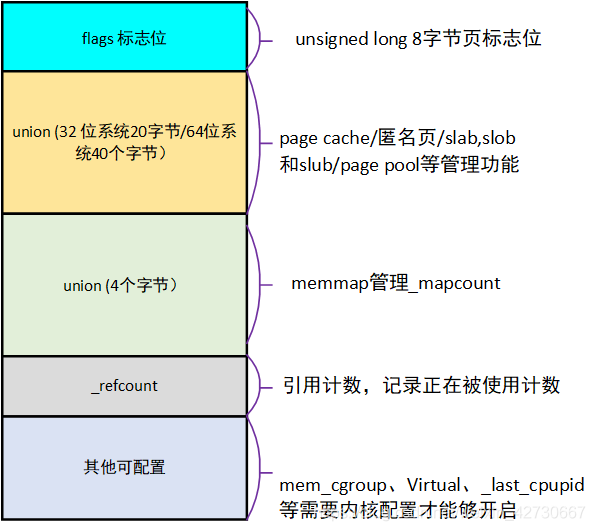
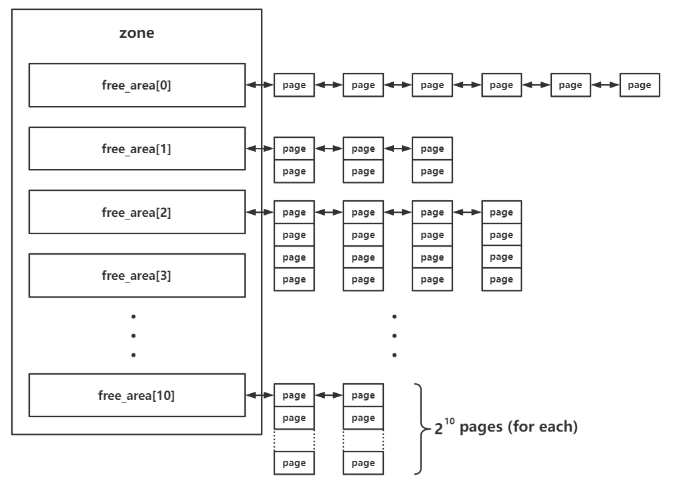
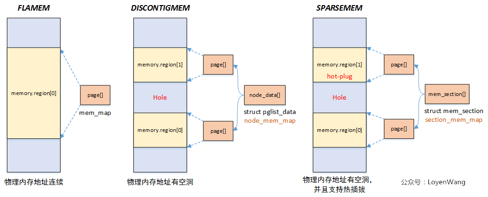
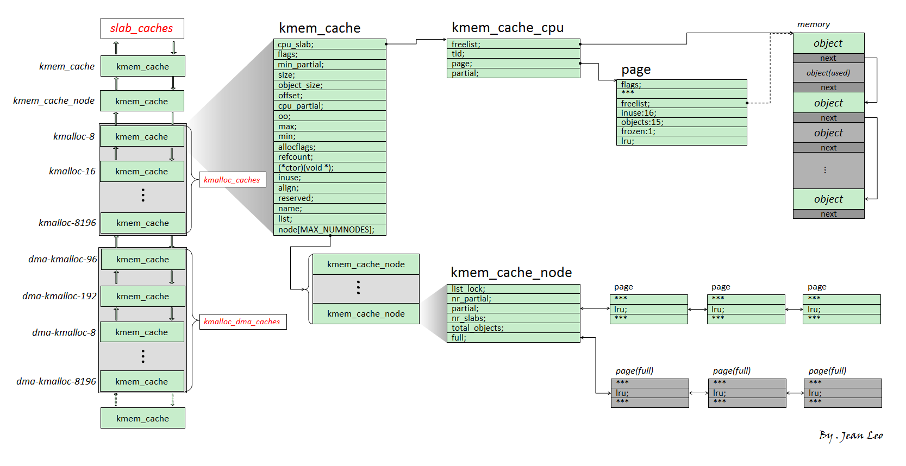

开始学习kernel pwn，在用户态pwn中，我们需要利用用户态程序的漏洞，劫持该程序的执行流，从该程序中起一个`shell`，或者走`orw`获得`flag`。kernel pwn中类似，我们需要利用内核的漏洞，劫持程序流使其能够提权到`root`或者使其能泄露敏感信息`flag`。

**kernel pwn和用户态pwn在本质上并没有区别**，利用思路都是相似的，只是细节上会有所差别。一般来说，kernel pwn也不会让我们找内核中的漏洞，而是给出一个有问题的`LKM`让我们分析。

<!--more-->

## Kernel

kernel也就是内核，是操作系统的核心部分，用来管理软件发出的数据 I/O 要求，将这些要求转义为指令，交给 CPU 和计算机中的其他组件处理。kernel处在应用程序和硬件之间，向上对应用程序提供硬件的使用接口，向下按照应用程序的要求与硬件进行交互。



但无论是应用程序还是操作系统，他们始终都是**程序**，他们**都是在物理地址上运行的代码和数据**，他们之间的区别主要在于**权限**。操作系统能够使用**所有的指令**，这使**内核态代码能完全使用所有硬件**，而应用程序只能使用**一部分指令**，这导致**用户态代码只能部分使用硬件**。

需要注意的是，**kernel 的 crash 通常会引起重启**。

### 内核架构

通常来说我们可以把内核架构分为两种：`宏内核`和`微内核`，现在还有一种内核是混合了宏内核与微内核的特性，称为 `混合内核` ，宏内核和微内核的区别如下：

- 宏内核：此架构的特性是**整个内核程序是一个单一二进制可执行文件**，**几乎所有功能都被集成进内核**。在内核态以监管者模式（Supervisor Mode）来运行在一个单独的地址空间**，所有的内核服务都在一个地址空间运行，相互之间直接调用函数**，简单高效。宏内核会定义出一个高端的虚拟接口，由该接口来涵盖描述整个电脑硬件，这些描述会集合成一组硬件描述用词，有时还会附加一些系统调用，如此可以用一个或多个模块来实现各种操作系统服务。
- 微内核：内核中只有最基本的调度、内存管理。驱动、文件系统等都是用户态的守护进程去实现的，**微内核中功能被划分成独立的过程**，**过程间通过IPC进行通信**。模块化程度高，一个服务失效不会影响另外一个服务。

**Linux Kernel采用的是宏内核**。

## **hierarchical protection domains**（分级保护域）

intel CPU将权限划分为`Ring0、Ring1、Ring2、Ring3`四个等级，就像这四个等级的名字一样，四个等级构成四个环。

越里面的环的权限越高，使用硬件的能力越强，其中`Ring0`表示最高权限，`Ring3`表示最低权限。通过这种方式对计算机的资源进行分级，实现权限的管理。



`Ring0`拥有最高特权，并且可以和最多的硬件直接交互（比如CPU，内存），因此**操作系统内核代码通常运行在 `Ring0` 下，即 CPU 在执行操作系统内核代码时处在`Ring0` 下**。

应用程序代码通常处在`Ring3`，拥有的权限最低，即 **CPU 在执行用户进程代码时处在 ring3 下**。

那么什么是用户态，什么是内核态呢？

- 用户态：CPU 运行在 `Ring3` + 用户进程运行环境上下文
- 内核态：CPU 运行在 `Ring0` + 内核代码运行环境上下文

## 状态切换

当发生**系统调用(syscall,int 0x80)，产生异常，外设产生中断**等事件时，会发生**用户态到内核态**的切换，具体的过程为：

1. 通过 `swapgs` 切换`GS`段寄存器，将 `GS` 寄存器值**和一个特定位置的值进行交换**，目的是保存`GS`值，同时将该位置的值**作为内核执行时的`GS`值**使用。
2. 将当前栈顶（用户空间栈顶）记录在 **CPU 独占变量区域**里，将 CPU 独占区域里记录的**内核栈顶**放入 `rsp/esp`。
3. 通过 push 保存各寄存器值:

```c
 ENTRY(entry_SYSCALL_64)
 /* SWAPGS_UNSAFE_STACK是一个宏，x86直接定义为swapgs指令 */
 SWAPGS_UNSAFE_STACK

 /* 保存栈值，并设置内核栈 */
 movq %rsp, PER_CPU_VAR(rsp_scratch)
 movq PER_CPU_VAR(cpu_current_top_of_stack), %rsp


/* 通过push保存寄存器值，形成一个pt_regs结构 */
/* Construct struct pt_regs on stack */
pushq  $__USER_DS      /* pt_regs->ss */
pushq  PER_CPU_VAR(rsp_scratch)  /* pt_regs->sp */
pushq  %r11             /* pt_regs->flags */
pushq  $__USER_CS      /* pt_regs->cs */
pushq  %rcx             /* pt_regs->ip */
pushq  %rax             /* pt_regs->orig_ax */
pushq  %rdi             /* pt_regs->di */
pushq  %rsi             /* pt_regs->si */
pushq  %rdx             /* pt_regs->dx */
pushq  %rcx tuichu    /* pt_regs->cx */
pushq  $-ENOSYS        /* pt_regs->ax */
pushq  %r8              /* pt_regs->r8 */
pushq  %r9              /* pt_regs->r9 */
pushq  %r10             /* pt_regs->r10 */
pushq  %r11             /* pt_regs->r11 */
sub $(6*8), %rsp      /* pt_regs->bp, bx, r12-15 not saved */
```

4. 通过汇编指令判断是否为 `x32_abi`（表示是否为32位系统）。
5. 通过**系统调用号**，跳到全局变量 `sys_call_table` 相应位置继续执行系统调用。

当在内核态中的工作执行完时，会从**内核态返回用户态**，过程如下：

1. 通过 `swapgs` 恢复`GS`值
2. 通过 `sysretq` 或者 `iretq` 恢复到用户控件继续执行。如果使用 `iretq` 还需要给出用户空间的一些信息（CS, eflags/rflags, esp/rsp 等）

## 系统调用

系统调用提供用户程序与操作系统间的接口，部分库函数（如 scanf，puts 等 IO 相关的函数实际上是对系统调用的封装（read 和 write））。当用户空间的程序利用现有权限无法满足需求时，就会进行系统调用向操作系统内核请求需要更高权限的服务。在这个过程中，用户进程会**暂时陷入内核态，待内核工作完成后再返回用户态**。

64位和32位的系统调用号分别存放在 `/usr/include/x86_64-linux-gnu/asm/unistd_64.h` 和 `/usr/include/x86_64-linux-gnu/asm/unistd_32.h` 。

根据系统位数不同，Linux 下系统调用的方式也不同：

- 32位：执行 `int 0x80 `汇编指令（80号中断）
- 64位：执行 `syscall` 汇编指令 / 执行 `sysenter` 汇编指令（only intel）

用户态进入到内核态的流程如下：

通过`eax/rax`寄存器存放**系统调用号**，并通过寄存器存放该系统调用的参数：

- 32 位：`ebx、ecx、edx、esi、edi、ebp`作为第一个参数、第二个参数…进行参数传递
- 64 位：`rdi、rsi、rdx、rcx、r8、r9`作为第一个参数、第二个参数…进行参数传递

同样地，内核执行完系统调用后退出系统调用也有对应的两种方式：

- 执行`iret`汇编指令
- 执行 `sysret` 汇编指令 / 执行`sysexit`汇编指令（only Intel）

## 进程权限管理

kernel调度所有计算机资源，并为应用程序提供他们的抽象，相应的，应用程序的权限也由kernel来管理，kernel决定一个应用程序是否有权限使用某一抽象。

在内核中使用结构体 `task_struct` 表示一个进程，该结构体定义于内核源码`include/linux/sched.h`中，其中的内容大致如下：



### 结构体cred

在结构体`task struct`中就包含有权限的信息，**Process credentials** 就是 kernel 用以判断一个进程权限的凭证，在 kernel 中使用 `cred` 结构体进行标识，对于一个进程而言应当有三个 cred：

- **ptracer_cred：**使用`ptrace`系统调用跟踪该进程的上级进程的cred（gdb调试便是使用了这个系统调用，常见的反调试机制的原理便是提前占用了这个位置）
- **real_cred：**即**客体凭证**（**objective cred**），通常是一个进程最初启动时所具有的权限
- **cred：**即**主体凭证**（**subjective cred**），该进程的有效cred，kernel以此作为进程权限的凭证

一般情况下，主体凭证与客体凭证的值是相同的

```c
/* Process credentials: */

/* Tracer's credentials at attach: */
const struct cred __rcu        *ptracer_cred; //gdb调试使用该cred

/* Objective and real subjective task credentials (COW): */
const struct cred __rcu        *real_cred; //进程最初的权限

/* Effective (overridable) subjective task credentials (COW): */
const struct cred __rcu        *cred; //进程当前的权限
```

结构体`cred`定义于内核源码`include/linux/cred.h`中，用于表示权限凭证：

```c
struct cred {
    atomic_t    usage;
#ifdef CONFIG_DEBUG_CREDENTIALS
    atomic_t    subscribers;    /* number of processes subscribed */
    void        *put_addr;
    unsigned    magic; //可用于寻找cred结构体
#define CRED_MAGIC    0x43736564
#define CRED_MAGIC_DEAD    0x44656144
#endif
    //各种ID
    kuid_t        uid;        /* real UID of the task */ 
    kgid_t        gid;        /* real GID of the task */
    kuid_t        suid;        /* saved UID of the task */
    kgid_t        sgid;        /* saved GID of the task */
    kuid_t        euid;        /* effective UID of the task */
    kgid_t        egid;        /* effective GID of the task */
    kuid_t        fsuid;        /* UID for VFS ops */
    kgid_t        fsgid;        /* GID for VFS ops */
    
    unsigned    securebits;    /* SUID-less security management */
    kernel_cap_t    cap_inheritable; /* caps our children can inherit */
    kernel_cap_t    cap_permitted;    /* caps we're permitted */
    kernel_cap_t    cap_effective;    /* caps we can actually use */
    kernel_cap_t    cap_bset;    /* capability bounding set */
    kernel_cap_t    cap_ambient;    /* Ambient capability set */
#ifdef CONFIG_KEYS
    unsigned char    jit_keyring;    /* default keyring to attach requested
                     * keys to */
    struct key    *session_keyring; /* keyring inherited over fork */
    struct key    *process_keyring; /* keyring private to this process */
    struct key    *thread_keyring; /* keyring private to this thread */
    struct key    *request_key_auth; /* assumed request_key authority */
#endif
#ifdef CONFIG_SECURITY
    void        *security;    /* subjective LSM security */
#endif
    struct user_struct *user;    /* real user ID subscription */
    struct user_namespace *user_ns; /* user_ns the caps and keyrings are relative to. */
    struct group_info *group_info;    /* supplementary groups for euid/fsgid */
    /* RCU deletion */
    union {
        int non_rcu;            /* Can we skip RCU deletion? */
        struct rcu_head    rcu;        /* RCU deletion hook */
    };
} __randomize_layout;
```

`cred`结构体中记录了**一个进程四种不同种类的UID（用户ID）和GID（组ID）**：

- **真实ID**（real ID）：标识一个进程**启动时的ID**
- **保存ID**（saved ID）：标识一个进程**最初的有效ID**
- **有效ID**（effective ID）：标识一个进程**正在运行时所属的ID**，一个进程在运行途中是可以改变自己所属用户和组的，因而权限机制也是**通过有效ID进行认证**的，内核通过有效ID来进行特权判断；为了防止用户一直使用高权限，**当任务完成之后，有效ID会与保存ID进行交换**，恢复进程的有效权限
- **文件系统ID**（ID for VFS ops）：标识一个进程**创建文件时进行标识的ID**

通常情况下这几个ID都是相同的。

### 提权

一个进程的权限是由位于内核空间的`cred`结构体进行管理的，因此只要改变一个进程的`cred`结构体，就能改变其执行权限，在内核空间有如下两个函数，都位于`kernel/cred.c`中，可以用于改变`cred`结构体：

- `struct cred* prepare_kernel_cred(struct task_struct* daemon)`：该函数用以拷贝一个进程的cred结构体，并返回一个新的cred结构体，需要注意的是`daemon`参数应为**有效的进程描述符地址或NULL**
- `int commit_creds(struct cred *new)`：该函数用以将一个新的`cred`结构体应用到进程

在`prepare_kernel_cred()`函数中，若传入的参数为NULL，则会缺省使用`init`进程的`cred`作为模板进行拷贝，**即可以直接获得一个标识着root权限的cred结构体**

那么我们不难想到，只要我们能够**在内核空间执行`commit_creds(prepare_kernel_cred(NULL))`**，那么就能够将当前进程的权限提升到`root`

## 文件

Linux系统的设计中秉承着**万物皆文件**的思想，因此**所有计算机资源都被抽象为文件**，无论是硬件设备、目录、普通文件、管道，甚至进程、磁盘都被抽象成文件。基于这种设计，**所有计算机资源都可以通过访问文件的形式进行操作，所有读操作都可以使用`read`完成，所有写操作都可以使用`write`完成**，所有操作最后都可以以读写的方式实现。

### 进程文件系统

我们知道Linux系统中的进程也被抽象成了文件，那就代表它的数据以文件的形式存放，并且我们可以通过访问文件的形式对其进行读写。

进程文件系统（process file system， 简写为procfs）用以描述一个进程，其中包括该进程所打开的文件描述符、堆栈内存布局、环境变量等等。它本身是一个伪文件系统，通常被挂载到`/proc`目录下，并不真正占用储存空间，而是占用一定的**内存**。当一个进程被建立起来时，其进程文件系统便会被**挂载到`/proc/[PID]`**下，我们可以在该目录下查看其相关信息。

### 文件的访问

进程通过**文件描述符**（**file descriptor**）来完成对文件的访问，文件描述符是一个非负整数，本质上是对文件的索引值，进程所有执行 I/O 操作的系统调用都会通过文件描述符来找到对应文件。

每个进程都**独立有着一个文件描述符表**，存放着该进程所打开的文件索引，每当进程**成功**打开一个现有文件/创建一个新文件时（通过系统调用open进行操作），**内核会向进程返回一个文件描述符**。在kernel中有着一个文件表，由所有的进程**共享**。

详细可以回看`IO_FILE`部分。

### iotcl

操作系统向应用程序提供了系统调用，使应用程序可以**通过内核访问标准外部设备**，因为大多数硬件设备只能够在内核空间内直接寻址。

但是当访问**非标准**硬件设备时，使用系统调用显得不合适， 因为部分设备可能没有被内核考虑到，这样应用程序就无法使用该设备了，这时候就需要用户模式直接访问设备。

为了解决这个问题，内核被设计成**可扩展**的，可以加入一个称为**设备驱动**的模块，**驱动的代码允许在内核空间运行而且可以对设备直接寻址**。并且预留了一个**系统调用`iotcl`用于用户空间和设备驱动的通信**。

对设备驱动的请求是一个**以设备和请求号码为参数**的`ioctl`调用，如此内核就允许用户空间访问设备驱动进而访问设备而不需要了解具体的设备细节，同时也不需要一大堆针对不同设备的系统调用。

```c
int ioctl(int fd, unsigned long request, ...)
```

- **fd：设备的文件描述符**
- **request：请求码**
- **其他参数**

## Loadable Kernel Modules(LKMs)

Linux Kernel采用宏内核架构，一切的系统服务都需要由内核来提供，虽然效率较高，但是**缺乏可扩展性与可维护性**。同时内核需要装载很多可能用到的服务，但这些服务最终可能未必会用到，还会**占据大量内存空间**，如果要加入的新服务往往意味着要**重新编译整个内核**。

**可加载内核模块（Loadable Kernel Modules，即LKMs）**的设计就是为了解决上述问题。在内核空间运行的LKMs可以为应用程序提供**新的系统调用或服务**，同时LKMs可以像积木一样从内核中被**装载/卸载**，大大提高了kernel的可拓展性与可维护性

可加载内核模块 (或直接称为内核模块) 就像运行在内核空间的可执行程序，包括:

- 驱动程序（Device drivers）
    - 设备驱动
    - 文件系统驱动
    - ...
- 内核扩展模块 (modules)

LKMs与用户态可执行文件一样都**采用ELF格式**，但是**LKMs运行在内核空间，且无法脱离内核运行**

通常与LKM相关的命令有以下三个：

- `lsmod`：列出现有的LKMs
- `insmod`：装载新的LKM（需要root）
- `rmmod`：从内核中移除LKM（需要root）
- `modprobe`: 添加或删除模块，modprobe 在加载模块时会查找依赖关系

> 大多数CTF比赛中，kernel pwn的漏洞出现在 LKM 中。

## 内核内存管理

Linux kernel 将内存分为 `页→区→节点` 三级结构，主要有两个内存管理器—— `buddy system` 与 `slab allocator`。内存结构**自顶向下**依次为：

- 节点(node)
- 区(zone)
- 页(page)

### 内核内存结构

页：Linux kernel 中使用 `page` 结构体来表示一个物理页框，**每个物理页框都有着一个对应的 page 结构体**。




区：在 Linux 下将一个节点内**不同用途**的内存区域划分为不同的 `区（zone）`，对应结构体 `struct zone`。



节点：zone 再向上一层便是**节点**——Linux 将**内存控制器（memory controller）**作为节点划分的依据。

### 内存模型

Linux 提供了三种内存模型，定义于 `include/asm-generic/memory_model.h` 中。



内存模型在编译期就会被确定下来，目前常用的是 `Sparse Memory` 模型，即离散内存模型。

#### Flat Memory

平滑内存模型。物理内存地址连续，有一个**全局变量** `mem_map` ，通过一个大的 `struct page` 数组直接对应现有的物理内存。

#### Discontiguous Memory

非连续性内存模型。主要针对内存中存在空洞的情况。

对于**每一段连续的物理内存**，都有一个 `pglist_data` 结构体进行对应，其成员 `node_mem_map` 为一个 `struct page` 指针，指向一个 page 结构体数组，由该结构体对应到该段连续物理内存。

有一个**全局变量** `node_data` 为一个 `pglist_data` 指针数组，其中存放着指向每一个 `pglist_data` 的指针，该数组的大小为 `MAX_NUMNODES`。

#### Sparse Memory

离散内存模型。在一个 `mem_section` 结构体中存在一个 `section_mem_map` 成员指向一个 `struct page` 数组对应一段连续的物理内存，即**将内存按照 `section` 为单位**进行分段。

存在一个全局指针数组 `mem_section` （与结构体同名）存放所有的 `mem_section` 指针，指向**理论上支持的内存空间**，每个 `section` **对应的物理内存不一定存在**，若不存在则此时该 section 的指针为 NULL。

这种模型**支持内存的热拔插**。

### buddy system

`buddy system` 是 Linux kernel 中的一个较为底层的内存管理系统，**以内存页为粒度管理所有的物理内存**，其存在于 **区** 这一级别，对当前区所对应拥有的所有物理页框进行管理

在每个 zone 结构体中都有一个 `free_area` 结构体数组，用以存储 buddy system **按照 order 管理的页面**

```c
struct zone {
    //...
    struct free_area	free_area[MAX_ORDER];
    //...
```

`MAX_ORDER`为一个常量，其值为`11`。

在 buddy system 中**按照空闲页面的连续大小**进行**分阶**管理，这里的 order 的实际含义为**连续的空闲页面的大小**，不过单位不是页面数，而是`阶`，即对于每个下标而言，其中所存储的页面大小为：$2^{order}$。

`free_area`中的页面通过自身的相应字段形成**双向链表**结构：


- 分配：
    - 首先会将请求的内存大小向 2 的幂次方张内存页大小**对齐**，之后从**对应的下标**取出连续内存页
    - 若对应下标链表为**空**，则会从**下一个 order** 中取出内存页，**一分为二**，装载到当前下标对应链表中，之后再返还给上层调用，若下一个 order 也为空则会继续向**更高**的 order 进行该请求过程
- 释放：
    - 将对应的连续内存页释放到对应的链表上
    - 检索**是否有可以合并**的内存页，若有，则进行合成，放入**更高** order 的链表中

但是我们很容易产生**不容易合并**的内存碎片，因此 Linux kernel 还会进行 **内存迁移** 以减少内存碎片，主要由一个持续运行的内核线程完成。

### slab allocator

slab allocator 则是**更为细粒度的内存管理器**，其通过向 buddy system 请求**单张或多张连续内存页**后再分割成**同等大小**的**对象**（object）返还给上层调用者来实现更为细粒度的内存管理

slab allocator 一共有三种版本：

- slab（最初的版本，机制比较复杂，效率不高）
- slob（用于嵌入式等场景的极为简化版本）
- slub（优化后的版本，现在的通用版本）

#### 基本结构

slub allocator的基本结构如下：



slub allocator每次向buddy system请求得到的单**张/多张的内存页称为一个`slub`**，这个`slub`会被分为多个**同样大小**的对象(object)，每个object作为一个被分配的实体。在 `slub` 的**第一张内存页**对应的 page 结构体上的 `freelist` 成员指向该张内存页上的**第一个空闲对象**，一个 `slub` 上的**所有空闲对象**组成一个以 `NULL` 结尾的**单向**链表。

> object类似于堆中的chunk，不过由于page结构体与物理地址之间有线性对应关系，可以直接通过object地址找到对应的page结构体，因此不需要header

`kmem_cache`是allocator一个**分配组件**，用于**分配特定大小（特定用途）**的对象，所有的`kmem_cache`构成一个**双向**链表。存在两个结构体数组`kmalloc_caches`和`kmalloc_dma_caches`对`kmem_cache`进行管理。

一个`kmem_cache`主要由`kmem_cache_cpu`和`kmem_cache_node`组成。

- `kmem_cache_cpu`：这是一个**percpu 变量**（即每个核心上都独立保留有一个副本，原理是以` gs` 寄存器作为 `percpu` 段的基址进行寻址），用以表示**当前核心正在使用的 `slub`**，因此当前 CPU 在从 kmem_cache_cpu 上取 object 时**不需要加锁**，从而极大地提高了性能
- kmem_cache_node：可以理解为当前kmem_cache的 slub 集散中心，其中存放着**两个 slub 链表**：
    - partial：该 slub 上**存在**着一定数量的**空闲** object，但并非全部空闲
    - full：该 slub 上的**所有** object 都被**分配**出去了

#### 分配和释放

- 分配：
    - 首先从 `kmem_cache_cpu` 上取对象，若有则直接返回
    - 若 `kmem_cache_cpu` 上的 slub 已经无空闲对象了，对应 slub 会被加入到 `kmem_cache_node` 的 **full** 链表，并尝试从 **partial** 链表上取一个 slub 挂载到 `kmem_cache_cpu` 上，然后再取出空闲对象返回
    - 若 `kmem_cache_node` 的 partial 链表也空了，那就**向 buddy system 请求分配新的内存页**，划分为多个 object 之后再给到 `kmem_cache_cpu`，取空闲对象返回上层调用
- 释放：
    - 若被释放 object 属于 `kmem_cache_cpu` 的 slub，直接使用头插法插入当前 CPU slub 的 freelist
    - 若被释放 object 属于 `kmem_cache_node` 的 partial 链表上的 slub，直接使用头插法插入对应 slub 的 freelist
    - 若被释放 object 属于 `kmem_cache_node` 的 full 链表上的 slub，则其会成为对应 slub 的 freelist 头节点，**且该 slub 会从 full 链表迁移到 partial 链表**

#### slab alias

slab alias 机制是一种对**同等/相近大小** object 的 `kmem_cache` 进行**复用**的一种机制：

当一个 `kmem_cache` 在创建时，若已经存在能分配**相等/近似**大小的 object 的 `kmem_cache` ，则**不会创建新的 kmem_cache，而是为原有的 kmem_cache 起一个 alias，作为“新的” kmem_cache 返回**

对于初始化时设置了 `SLAB_ACCOUNT` 这一 flag 的 `kmem_cache` 而言，则会**新建**一个新的 `kmem_cache` 而非为原有的建立 alias。

如：在 Linux 4.4 之前的版本中，`cred_jar` 是 `kmalloc-192`的`alias`，在此之后的版本中，由于设置了`SLAB_ACCOUNT` 标志`cred_jar` 和 `kmalloc-192`是两个独立的 `kmem_cache`。（`cred_jar`是专门用于分配`cred`结构体的`kmem_cache`）

## 内核态函数

内核态的函数有些变化：

- printf() -> **printk()**，但需要注意的是 printk() 不一定会把内容显示到终端上，但一定在**内核缓冲区**里，可以通过 `dmesg` 查看效果
- memcpy() ->copy_from_user()/copy_to_user()
    - `unsigned long copy_from_user(void *to, const void __user *from, unsigned long n)`实现了将用户空间的数据传送到内核空间
    - `unsigned long copy_to_user (void __user * to, const void * from, unsigned long n) `实现了将内核空间的数据传送到用户空间
- malloc() -> **kmalloc()**，内核态的内存分配函数，和 malloc() 相似，但使用的是 `slab/slub 分配器`
- free() -> **kfree()**，同 kmalloc()

用于改变权限的函数：

- `struct cred* prepare_kernel_cred(struct task_struct* daemon)`：该函数用以拷贝一个进程的cred结构体，并返回一个新的cred结构体，需要注意的是`daemon`参数应为**有效的进程描述符地址或NULL**
- `int commit_creds(struct cred *new)`：该函数用以将一个新的`cred`结构体应用到进程

从函数名也可以看出，执行 `commit_creds(prepare_kernel_cred(0))` 即可获得 root 权限，0 表示 以 0 号进程作为参考准备新的 credentials。

## 内核态保护机制

与用户态类似，内核态也有对应的保护机制，canary, dep, PIE, RELRO 等保护与用户态原理和作用相同，除此之外，内核还有特殊的保护机制。

### KASLR

KASLR即`内核空间地址随机化`（kernel address space layout randomize），与用户态程序的ASLR相类似，在内核镜像映射到实际的地址空间时加上一个随机的偏移值，但是内核内部的**相对偏移**其实还是不变的

### FGKASLR

KASLR 虽然在一定程度上能够缓解攻击，但是若是攻击者通过一些信息泄露漏洞获取到内核中的某个地址，仍能够直接得知内核加载地址偏移从而得知整个内核地址布局，这在用户态pwn中也已经见怪不怪了。

因此有研究者基于 KASLR 实现了 FGKASLR，**以函数粒度重新排布内核代码**，将每个函数单独分段，每个段的偏移随机化，这会大大提高攻击的难度。目前，FGKASLR 只支持 x86_64 架构。

### SMEP/SMAP

SMEP即**管理模式执行保护**（Supervisor Mode Execution Protection）。当处理器处于 `ring0` 模式（内核态）时，**执行用户空间的代码**会触发页错误。（在 arm 中该保护称为 `PXN`）

 SMAP即**管理模式访问保护**（Superivisor Mode Access Protection），类似于 smep，当处理器处于 `ring0` 模式（内核态）时，**访问用户空间的数据**会触发错误。

这两种保护通常是同时开启的，用以阻止**内核空间直接访问/执行用户空间的数据**，完全地将内核空间与用户空间相分隔开，用以**防范ret2usr**（return-to-user，将内核空间的指令指针重定向至用户空间上构造好的提权代码）攻击。

绕过方法：

- 利用内核线性映射区对物理地址空间的完整映射，找到用户空间对应页框的内核空间地址，利用该内核地址完成对用户空间的访问（即**一个内核空间地址与一个用户空间地址映射到了同一个页框上**），这种攻击手法称为`ret2dir`
- Intel下系统根据CR4控制寄存器的第20位标识是否开启SMEP保护（1为开启，0为关闭），若是能够通过kernel ROP**改变CR4寄存器的值**便能够关闭SMEP保护，完成SMEP-bypass，接下来就能够重新进行 ret2usr，**但对于开启了 KPTI 的内核而言，内核页表的用户地址空间无执行权限，这使得 ret2usr 彻底成为过去式**。

### STACK PROTECTOR

类似于用户态程序的 canary，通常又被称作是 stack cookie，用以检测**是否发生内核堆栈溢出**，若是发生内核堆栈溢出则会产生 kernel panic

内核中的 canary 的值通常**取自`GS`段寄存器某个固定偏移处的值**，可以尝试劫持这个值。

### KPTI

KPTI即**内核页表隔离**（Kernel page-table isolation），内核空间与用户空间分别使用**两组不同的页表集**，这对于内核的内存管理产生了根本性的变化

### Hardened Usercopy

`hardened usercopy`在用户空间与内核空间之间拷贝数据时进行越界检查，**主要检查拷贝过程中对内核空间中数据的读写是否会越界（包括读写两方面）**。常用于`copy_to_user()`和`copy_form_user()`。

绕过方式：这种保护不适用于内核空间之间的数据拷贝。

###  Hardened freelist

在开启这种保护之前，`slub` 中的 `free object` 的 `next` 指针直接存放着 `next free object` 的地址，攻击者可以通过读取 `freelist` 泄露出内核线性映射区的地址。

在开启了该保护之后 `free object` 的 `next` 指针存放的是由以下三个值进行**异或**操作后的值：

- 当前 `free object` 的地址
- 下一个 `free object` 的地址
- 由 `kmem_cache` 指定的一个 random 值

这使得攻击者必须要获取第一和第三个值才能修改`free list`

###  Random freelist

这种保护主要发生在 slub allocator 向 buddy system 申请到页框之后的处理过程中，对于未开启这种保护的一张完整的 slub，其上的 object 的连接顺序是**线性连续**的，但在开启了这种保护之后其上的 object 之间的连接顺序是**随机**的，这让攻击者**无法直接预测**下一个分配的 object 的地址

需要注意的是这种保护发生在**slub allocator 刚从 buddy system 拿到新 slub 的时候，运行时 freelist 的构成仍遵循 LIFO**

###  CONFIG_INIT_ON_ALLOC_DEFAULT_ON

当编译内核时开启了这个选项时，在内核进行“堆内存”分配时（包括 buddy system 和 slab allocator），**会将被分配的内存上的内容进行清零**，从而防止了利用未初始化内存进行数据泄露的情况

## kernel pwn相关文件

kernel pwn的题目一般会给以下三个文件：

1. boot.sh: 一个用于启动 kernel 的 shell 的脚本，多用 qemu，保护措施与 qemu 不同的启动参数有关
2. bzImage: kernel binary
3. rootfs.cpio: 文件系统映像

qemu部分参数说明如下：

- `-m`：虚拟机内存大小
- `-kernel`：内存镜像路径(bzimage)
- `-initrd`：磁盘镜像路径(rootfs.cpio)
- `-append`：附加参数选项
    - `nokalsr`：关闭内核地址随机化，方便我们进行调试
    - `rdinit`：指定初始启动进程，`/sbin/init`进程会默认以 `/etc/init.d/rcS` 作为启动脚本
    - `loglevel=3 `& `quiet`：不输出log
    - `console=ttyS0`：指定终端为`/dev/ttyS0`，这样一启动就能进入终端界面
- `-monitor`：将监视器重定向到主机设备`/dev/null`，这里重定向至null主要是防止CTF中被人给偷了qemu拿flag，遇到没有这一行的可以直接通过`ctrl a + c`进入`qemu`的`monitor`模式，之后通过`migrate "exec: cat rootfs.cpio 1>&2"`查看`rootfs.cpio`文件，在其中找`flag`。

- `-cpu`：设置CPU安全选项（如smep保护）
- `-s`：相当于`-gdb tcp::1234`的简写（也可以直接这么写），后续我们可以通过gdb连接本地端口进行调试

