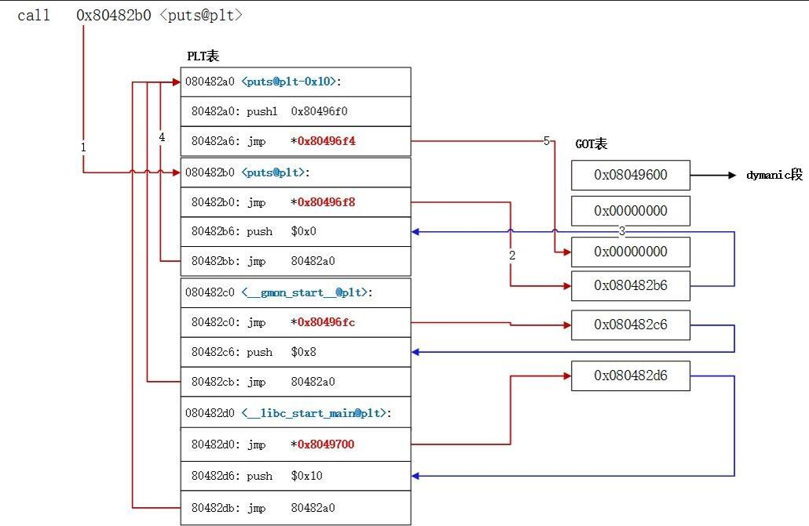

ROP是面向返回的编程，通过一个个gadget来进行编程，**改变寄存器以及变量的值**，每一个gadget在执行了其指令后会通过**ret**返回到下一个gadget，从而达到控制程序执行流的目的。
<!--more-->
## ret2libc

当有NX保护，无法执行shellcode，也无syscall和后门函数的话，通过ret2libc也可以达成get shell的目的。

绝大部分程序运行前都会链接到**libc库**，并调用库中的函数实现功能，比如write、read、puts、system等函数就是这个库中的函数。ret2libc主要是利用libc中的函数达到get shell的目的，虽然程序中没有利用到system函数和"/bin/sh"，但在程序的libc中，这些内容都是**存在**的，只要能找到他们的地址，并能控制程序的执行流执行他们，就可以达到get shell的目的。

system和"/bin/sh"的地址可以通过在程序中出现的libc库函数的地址得到。在一个版本的libc中，各个函数的位置是固定的，也就是说，**函数和libc基地址之间的偏移是固定的**，因此，通过pwntools的ELF模块解析了libc之后，就可以得到各个函数的偏移，通过已知函数的地址，就能知道system函数和"/bin/sh"的地址。

### 延迟绑定机制(lazy binding)

为了减少程序编译花费的时间，会采用**动态链接**的技术，在编译过程中，用**偏移**去表示函数的位置，**在程序运行时才将该函数的真实地址得出写入**，其中的延迟绑定机制是在**函数第一次运行时才将该函数的真实地址得出写入**。

为了实现延迟绑定，编译时需要用到PLT和GOT进行辅助。GOT是全局偏移表，包括了.got表和.got.plt表，**.got表记录全局变量的地址，.got.plt表记录全局函数的地址**，PLT是进程链接表，.plt记录了**函数在GOT表中的位置和调用解析函数的代码**，保存在代码段中，在进程加载和运行的时候都不会改变。

在程序中，call调用的是实际上是函数在.plt表中的内容。

```
call xxx@plt
xxx@plt指向xxx函数在.plt表中的内容

xxx@plt:
jump *(xxx@got) //跳转到xxx函数在.got.plt表中的内容
push index      //将一个数index入栈
jump got[0]     //跳转到.got表的第一项，也就是符号解析函数处
```

最开始时，xxx函数在 **.got.plt表中的内容** 是 **xxx@plt+6，也就是push index的地址**，并跳转到符号解析函数处进行解析，将xxx函数的**真实地址**（在.got表中的内容）**写入**xxx函数在.got.plt表中的位置，从第二次开始就可以直接跳转到真实的地址**直接执行**。

下图可以看出plt和got表的关系




### 对抗ASLR/PIE

在开启了ASLR和PIE之后，程序基地址和libc基地址都会**随机化**，因此对libc的泄露就不再显然。需要利用程序中的输出函数（如：write、puts）将程序中.plt表中

## csu

## BROP

## SROP
