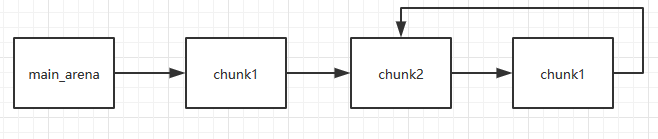

堆的利用方式非常多，但大多都不能直接获得shell，而是通过**改变程序流程**或者获得**任意写**再利用其它方式获得shell（如修改hook为one_gadget，FSOP等等）。
<!--more-->

### 堆溢出

和栈溢出类似，堆溢出漏洞源于程序没有对写入的数据长度进行合理的控制，导致**程序向chunk中写入了超出其可使用大小的数据**(可使用大小不一定等于申请的大小，如large bin的切割机制导致了可使用的大小会大于申请的大小)。

不同与栈溢出，堆溢出无法直接控制返回地址，其利用主要如下：

1. 覆盖**物理地址上后面**的chunk的内容（如prev_size,size及其标志位,chunk中保存的内容）。
2. 协助其它机制实现任意写（如unlink），通常是修改fd,bk,fd_nextsize,bkk_nextsize。

### 堆的Off-By-One

严格来说 off-by-one 漏洞是一种特殊的溢出漏洞，即**仅仅溢出了一个字节**，通常在程序的边界检查不严格（循环设置出错）和字符串操作（没有注意末尾的'\x00'）中出现。

利用方式：

1. 溢出字节为可控制任意字节：通过修改size造成块结构之间出现重叠，从而泄露其他块数据，或是覆盖其他块数据。
2. 溢出字节为NULL：在 size 为 0x100 的时候，溢出 NULL 字节可以使得 prev_inuse 位被清，这样前块会被认为是free块。
    （1）这时可以选择使用 nlink方法进行处理。
    （2）另外，这时 prev_size 域就会启用，就可以伪造 prev_size ，从而造成块之间发生重叠。（旧的unlink没有检查按照 prev_size 找到的块的大小与prev_size 是否一致）。

`libc-2.29`增加了检测`next chunk`的`prev_size`，会报错：`malloc(): mismatching next->prev_size (unsorted)`，也增加了检测`next chunk`的地址是不是个堆块，会报错`malloc(): invalid next size (unsorted)`。
`libc-2.23(11)`的版本，当释放某一个非`fast bin`的堆块时，若上/下某堆块空闲，则会检测该空闲堆块的`size`与其`next chunk`的`prev_size`是否相等。

### chunk extend and overlapping（好像还有chunk shrink的，但没找资料）

chunk extend 是堆漏洞的一种常见利用手法，通过 extend 可以实现 chunk overlapping 的效果。实现overlapping之后，不但可以读取**已经free了的chunk的数据来泄露**信息（如unsorted bin头的main_arena+96），还可以对**bin或tcache中的chunk的内容进行修改**（如修改fd,bk）来协助进行其它攻击。

chunk extend的原理在于：**ptmalloc通过prev_size和size的内容判断chunk的使用情况和对chunk的前后块进行定位**。简而言之，chunk extend通过**控制size和prev_size**来实现overlapping。实现chunk extend的前提是：能够控制size或prev_size。

利用方法：

1. 将chunk的size位改大，使其包含下一个chunk的内容后，将其释放。这样会将两个chunk一起释，再次请求可将两个chunk的内存一起请求回来，导致第二个chunk能在两个地方被控制，从而实现overlapping。
2. 将已经释放的chunk的size位改大，这样malloc的时候就能把后面的内存一并申请出来，实现overlapping。（与1.类似）
3. 修改chunk的prev_size和prev_inuse位，通过free前向合并时通过prev_size去定位，合并没有被释放的内存，实现overlappping。

### unlink

对unlink的利用，其实是对chunk进行内存布局，然后借助unlink操作来达成**修改指针**的效果。

如果不考虑保护和针对large bin的操作的话，unlink主要的操作是：

```c
//P是要取出的chunk
FD=P->fd;//FD为P的下一个chunk
BK=P->bk;//BK为P的前一个chunk

//在fd和bk的双向链表中去掉P
FD->bk=BK;
BK->fd=FD;

```

重点在于后面对bk和fd的修改:

```c
//在fd和bk的双向链表中去掉P
FD->bk=BK;
BK->fd=FD;

//等价于
*(FD+0x18)=BK
*(BK+0x10)=FD
```

因此，如果我们能让FD，即**FD指向目标地址addr-0x18的位置，并且BK为我们想要修改为的内容value**，而且*(value+0x10)可写，那么我们就可以修改addr为我们指定的内容value。（比如可以修改GOT表项）

然而现在的libc中，**进行赋值之前**有对fd和bk的检查:

```c
// fd bk
if (__builtin_expect (FD->bk != P || BK->fd != P, 0))                      
  malloc_printerr (check_action, "corrupted double-linked list", P, AV);  
```

为了绕过检查，我们需要伪造FD和BK，使其满足下列条件之后才能赋值。

```c
*(fakeFD+0x18)==P==*(fakeBK+0x10)
//因此fakeFD=&P-0x18
//fakeBK=&P-0x10
```

执行unlink时

```c
*(fakeFD+0x18)=fakeBK
*(fakeBK+0x10)=fakeFD
//由于*(FD+0x18)==P==*(BK+0x10)
//因此等价于
//*P=&P-0x10
//*P=&P-0x18
```

最终*P=&P-0x18，即P指向了比原来低0x18的位置。

通过这种方法，如果我们能控制small bin或unsorted bin中chunk的fd和bk，并且我们能知道这个chunk的地址，那么就可以利用unlink使得该chunk指针ptr指向ptr-0x18的位置。

过程：

1. 修改ptr->fd=ptr-0x18
2. 修改ptr->bk=ptr-0x10
3. 触发unlink

### Use After Free(UAF)

就像它的名字一样，UAF指的是1个chunk被释放后被使用，主要有2种情况：

1. chunk被释放后，对应的指针赋值为NULL，但其他函数执行前没有进行检查，仍会对其进行操作，导致程序崩溃。
2. chunk被释放后，对应的指针没有被赋NULL，此时其他函数可以正常对该chunk进行操作。

一般第2种情况是我们利用的。UAF需要搭配其他方法进行使用，比如根据unsorted bin chunk的特性，用函数输出已经释放的chunk中的内容，从而泄露信息；或者用来修改fast bin chunk的fd，达到fast bin attack...

### Fast bin Attack

Fastbin Attack通常指基于fastbin机制的利用，利用的前提是：

- 存在堆溢出或UAF等能控制chunk内容的漏洞
- 漏洞发生于fast bin chunk

Fastbin Attack主要利用的是fastbin的特殊机制，fastbin是使用**单链表(fd)**来维护释放的堆块的，并且由fastbin管理的 chunk**即使被释放，其next_chunk的prev_inuse位也不会被清空**。 

#### Fastbin Double Free

Fastbin Double Free通过对1个chunk的多次释放，改变fast bin中fd的指向。其利用的主要是**fastbin不会清空prev_inuse位**，并且在释放时，**只检查当前释放的chunk与bin头结点指向的chunk是否相同**，而没有检查后续的chunk的机制。

因此，我们只要在两次释放之间隔着一个不同的chunk，就可以实现Fastbin Double Free。

在释放之后，fast bin的结构如下：



在1次malloc之后，我们可以使用多个指针控制同一个堆块，这可以用于篡改一些堆块中的关键数据域或者是实现类似于类型混淆的效果。如果**更进一步修改 fd 指针**，则能够实现**任意地址分配堆块**的效果 (首先要通过验证，即size符合当前fast bin的大小)，这就相当于任意地址任意写的效果。

#### House of Spirit

House of Spirit是通过在目标位置**伪造**fastbin chunk，并让其被释放，从而达到**申请指定地址内存**的目的。

由于free的特性，House of Spirit的重点在于**修改指定地址前后的内容使其能绕过free的检测**。

需要的绕过：

- fake chunk的**ISMMAP位不能为1**，因为 free 时，如果是mmap的chunk，会单独处理。
- fake chunk**地址需要对齐**。
- fake chunk的**size大小需要满足对应的fastbin** 的需求，同时也得**对齐**。
- fake chunk的next chunk的大小**不能小于2 * SIZE_SZ**，同时也**不能大于av->system_mem** 。
- fake chunk对应的fastbin**链表头部不能是该fake chunk**，即不能构成double free的情况。

在达成条件之后，将该fake chunk释放，再重新malloc就能得到该部分内存。

#### Arbitrary Alloc

由于fast bin中通过fd指向下一个chunk，如果我们**将想要获取的内存看作一个fake chunk**，那么只要其**size的大小满足fast bin的要求**，并且**控制fast bin中的fd指向fake chunk**，那么我们就能将这个fake chunk申请过来，实现任意读或任意写。

要让size满足要求，我们可以**逐字节进行调节（参考malloc到__malloc_hook的过程）**，找到在fast bin size范围内的大小，且能包含我们想要的内存即可。（由于不用绕过free，可以不用对齐）

要控制fast bin中chunk的fd，可以利用Fastbin Double Free、UAF、overlapping、堆溢出等方法。

### Unsorted bin Attack

Unsorted bin Attack是对unsorted bin机制的利用。

#### Unsorted bin Leak

Unsort bin Leak主要是利用了unsorted bin使用**fd和bk的双向链表**管理chunk的机制，**始终会有一个chunk的fd和一个chunk的bk指向unsorted bin的头结点，而头结点在main_arena内部**，与main_arena的偏移是固定的(96)。特别的，当只有1个chunk的时候，这个chunk的fd和bk都会指向一个unsorted bin的头结点。

因此，借助UAF、overlapping等方式，我们可以泄露unsorted bin头结点的地址，从而得到main_arena，再利用与main_arena固定偏移0x10的__malloc_hook得到出libc。（也可以通过malloc_trim()函数得出）

#### Unsorted bin Attack

Unsorted bin Attack利用了unsorted bin的特性，当一个chunk从unsorted bin中取出的时候，会将unsorted bin的地址写入到bck->fd的位置（bck==P->bk）。

```c
//相当于将unsorted bin放在了victim的位置，修改bck和bin的fd和bk指针
bck = victim->bk;
unsorted_chunks(av)->bk = bck;
bck->fd = unsorted_chunks(av);
```

换而言之，如果我们能**控制一个unsorted bin chunk的bk**，并且将其取出，那么就能**在bk+0x10的位置写入unsorted bin的地址**。这个地址通常是一个**很大的值**，借助这点，我们可以**控制程序执行流程**（改变判断条件，修改循环次数），甚至可以修改heap中的global_max_fast来**使得更大的chunk可以被视为fast bin**，这样我们就可以去执行一些fast bin attack了。

### Large bin Attack

Large bin Attack利用的是chunk从unsorted bin进入到large bin时缺少检查。当malloc遍历unsorted bin时，如果该chunk**不是刚好满足大小并且不满足切割条件**的话，则会放入对应的bin中。而在放入large bin的时候，缺少了对nextsize指针的检查。通过Large bin Attack，可以**将当前chunk的地址写入bk_nextsize+0x20的位置**（类似unsorted bin attack）。

在2.29及以下版本的glibc中，根据chunk的大小有不同的利用。

如果chunk**小于**该large bin中最小的chunk的时候会执行:

```c
fwd = bck; //使得fwd=large bin
bck = bck->bk; //使得bck=末尾的chunk(最小的chunk)

//下面均没有对victim的nextsize指针进行检测就直接赋值了
victim->fd_nextsize = fwd->fd;
victim->bk_nextsize = fwd->fd->bk_nextsize;
fwd->fd->bk_nextsize = victim->bk_nextsize->fd_nextsize = victim;
//fwd为当前chunk的fd指向的chunk，在这种情况下为large bin头，victim为当前chunk
//这条语句的作用是：修改通过nextsize指针连接的相邻chunk的fd_nextsize和bk_nextsize，即在nextsize list中插入新的chunk
```

如果chunk**大于**该large bin中最小的chunk的时候会执行:

```c
victim->bk_nextsize->fd_nextsize = victim;
```

如果chunk**等于**该large bin中最小的chunk，则会使用其他方法插入，所以此时无法利用。

在2.30版本新加入了对largebin跳表的完整性检查，使chunk大于链表中最小的chunk时的利用失效，必须使chunk**小于**链表中最小的chunk，通过下面的语句将当前chunk的地址写入bk_nextsize+0x20的位置。

```c
victim->bk_nextsize->fd_nextsize = victim;
```

Large bin Attack的条件：

1. 可以修改一个large bin chunk的 data
2. 从unsorted bin中来的large bin chunk要紧跟在被构造过的chunk的后面

作用：

1. 通过large bin attack可以辅助Tcache Stash Unlink+攻击
2. 可以修改_IO_list_all便于伪造_IO_FILE 结构体进行FSOP。

### Tcache Attack

由于Tcache本身检查约等于0，因此Tcache的利用都方便许多。其本身可以看作是没有什么检查的fast bin。

#### Tcache Poisoning

主要利用的是tcache_get()从tcache中获取chunk的时候几乎没有检查，会利fd指针逐个取出chunk。因此，只需要**将tcache中的chunk的fd指向任意内存即可将其取出**。

#### Tcache Dup（Tcache Double free）

类似于fast bin dup(Fast bin Double free)，不过利用的是tcache_put()中的不严谨，**可以直接连续free同一个chunk来做到double free**。

但在glibc2.29之后，tcache中增加了对此的检查，会在tcache_entry中引入一个标志key，表示chunk是否已经在该tcache bin中，每个chunk在放入tcache时都会检查key。

即便如此有些方法能绕过检查的，不过需要利用fast bin double free和tcache stash机制。

(1) 首先需要将tcache填满并实现fast bin double free

`tcache`中为：`C6->C5->C4->C3->C2->C1->C0`，`fast bin`中为：`C7->C8->C7`。

(2) 之后，为了分配到`fast bin`，需要先申请`7`个，让`tcache`为空（或`calloc`），再次申请时就会返回`fast bin`中的`C7`，同时由于`tcache stash`机制，`fast bin`中剩下的`C8`,`C7`均被放入了`tcache bin`。此时，在`C7`的`fd`字段写入`target_addr`（相当于获得了`Edit`功能），于是`target_addr`也被放入了`tcache bin`，因此这里`target_addr`处甚至不需要伪造`size`（`target_addr`指向`user data`区）。
(3) 此时，`tcache bin`中单链表为：`C8->C7->target_addr`，再申请到`target_addr`，从而得到了一个真正的任意写。

#### Tcache Perthread Corruption

tcache_perthread_struct是整个tcache的管理结构，而**这个结构是存储在堆上**的。如果能控制这个结构体，那么无论我们malloc的size是多少，地址都是可控的。不过这需要我们利用其它方法来申请到这块内存。

#### Tcache House Of Spirit

原理是House Of Spirit，不过由于tcache检查的松散，因此更容易利用，我们**可以不用管prev_inuse位**，但其他条件仍是需要满足的。

如：

- fake chunk的**ISMMAP位不能为1**，因为 free 时，如果是mmap的chunk，会单独处理。
- fake chunk**地址需要对齐**。
- fake chunk的next chunk的大小**不能小于2 * SIZE_SZ**，同时也**不能大于av->system_mem** 。

#### Tcache Stashing Unlink Attack

这种攻击利用的是tcache有**剩余**时，同大小的small bin会放进tcache中。在获取到一个smallbin中的一个chunk后会如果tcache仍有足够空闲位置，会将**剩余的**small bin链入tcache，在这个过程中**只对第一个bin进行了完整性检查**。


当攻击者可以写一个small bin的bk指针时，其可以在任意地址上写一个libc地址 (类似 unsorted bin attack 的效果)。构造得当的情况下也可以分配 fake chunk 到任意地址。

而calloc分配堆块时**不从tcache中选取，直接从small bin中取**，可以触发攻击。

具体利用：

想办法改写smallbin中**倒数第二个chunk的bk**指向fake chunk，在利用calloc取出了small bin中的一个chunk后，剩余的chunk会放入tcache中。Small bin遵循**FIFO**，**利用bk进行遍历**，因此倒数第二个chunk会先放入tcache，fake chunk会后放入tcache。由于tcache遵循**LIFO**，因此此时处于tcache头的是fake chunk，下一次malloc即可得到其内存。

#### libc leak

算是tcache带来的一点点麻烦，要用到bin的话需要先将对应的tcache填满。
