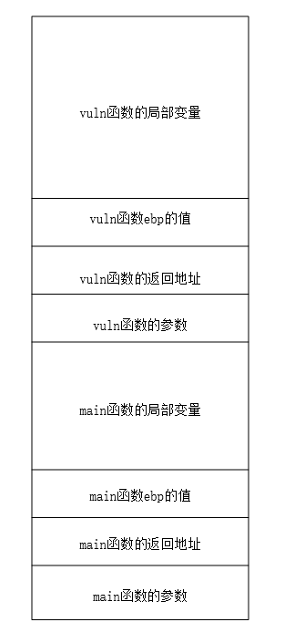

栈溢出是pwn的开始，是pwn中最基础的部分。不同系统的栈溢出利用会有所不同，但主要的思路都是一样的，下面主要记录的是linux下的栈溢出。
<!--more-->

## 函数调用栈

函数调用的过程是通过**栈**实现的，这个栈就是函数调用栈。

栈是一种先进后出（LIFO）的数据结构，有压栈(push)和出栈(pop)两种操作，函数调用栈中存放有函数调用信息和局部变量。
其中函数调用信息包括**函数的返回地址**、**ebp(或rbp)的保存值**、**函数的参数**。

不同位数对函数调用栈的利用有所不同：

- intel_x86(32位)：函数的参数全部保存在栈中

- intel_x64(64位)：函数的前六个整型或指针参数依次保存在寄存器rdi,rsi,rdx,rcx,r8,r9中，如果寄存器不够用才会保存在栈上

函数的参数会在函数调用前（执行call指令之前）**逆序**入栈


函数调用栈从**高地址向低地址生长**，也就是说高地址处为栈底。

在函数调用时，程序会执行call指令调用函数

```
call function_name  //调用函数
等价于下面两条指令
push ret_addr   //将函数返回地址（即函数执行完后执行的下一条指令的地址）push入栈
jump function_name  //跳转到调用函数的具体代码
```

在跳转到调用函数的具体代码后，会首先执行以下指令：

```
如果是64位则是rsp和rbp
push ebp    //将当前的ebp保存在栈上
mov esp , ebp   //将ebp的值赋值给esp,让他们指向同一处
sub esp , xh    //让esp的值减去x，为该函数的局部变量预留栈空间（此处的h表示x为16进制数）
```

在函数结束时，程序会执行leave和ret指令退出函数

```
如果是64位则是rsp、rbp和rip
leave
相当于下面两条指令
mov esp , ebp  //将ebp的值赋值给esp,让他们指向同一处
pop ebp    //将之前保存的ebp pop出栈

ret
相当于pop eip   //将之前保存的返回地址ret_addr pop到eip,eip寄存器中存放的是下一条要执行的指令的地址
```

## 栈溢出原理

在程序执行的过程中，**栈中变量**写入的字节数**超出**了这个变量申请的字节数，导致**写入内容覆盖了栈中后续的变量**。栈溢出漏洞轻则使程序崩溃，重则使程序的执行流被控制。

栈溢出漏洞是比较好发现的，只需要寻找**向栈上写入数据的函数**，并检查其**写入数据的字节数**是否合法即可。

如下列的程序片段：

```c
void vuln()
{
    char buf[0x10];
    read(0,buf,0x80);
    //gets(buf);
    //scanf("%s",buf);
    return;
}

int main()
{
    vuln();
    return 0;
}
```

在上面的vuln()函数中，**局部变量buf存储在栈上**，其申请的内存只有0x10字节，但在read()函数中却向buf中写入0x20字节，**超出了buf申请的范围**，除此之外，gets()函数和scanf()函数向buf中写入，但却没有检查写入的字节数目，因此也有栈溢出漏洞。

栈溢出漏洞通常利用超出范围的写入**修改栈上的其他变量**，可以通过**修改栈上的变量改变程序的执行流程**，也可以通过**修改变量后保存在栈上的ebp和返回地址值改变程序的执行流程**。

上述程序片段的栈空间如下：


通过栈溢出可以覆盖vuln()函数的ebp和返回地址。

## ret2txt

ret2txt是对程序原有代码片段的利用，通过栈溢出**将该函数的返回地址覆盖为程序原有的代码片段的地址**（如后门函数的地址），从而get shell。

## ret2shellcode

大部分程序都没有后门函数，因此ret2txt在许多场合下都是行不通的。因此需要我们自行写入一段能get shell的代码，这段代码就是shellcode。通过栈溢出**将该函数的返回地址覆盖为shellcode**即可get shell。

pwntools中可以很方便的得到shellcode。

```python
from pwn import*
context.arch='...'  #设置系统的架构，如amd64，i386...

shellcode = asm(shellcraft.sh())
```

然而ret2shellcode会受到**NX保护**的防护，在开启NX保护后，写入的shellcode所在的内存页不可执行，因此无法运行shellcode得到shell。

## ret2syscall

ret2syscall通过系统调用execve()执行execve("/bin/sh",NULL,NULL)进行get shell。

执行系统调用execve("/bin/sh",NULL,NULL)仅需要将需要的参数传到**寄存器**，之后控制程序执行**int 0x80(32位)**或**syscall(64位)**。

对于**32位**而言，需要将**系统调用号**传到**eax**寄存器，execve()的系统调用号为**11**；**第一个参数"/bin/sh"的地址**传到**ebx**寄存器；**第二、第三个**参数0传到**ecx,edx**寄存器。

对于**64位**而言，需要将**系统调用号**传到**rax**寄存器，execve()的系统调用号为**59**；**第一个参数"/bin/sh"的地址**传到**rdi**寄存器；**第二、第三个**参数0传到**rsi,rdx**寄存器。

如果有其他需要，也可以通过改变传入的系统调用号和参数执行其他的系统调用（如read、write、sigreturn）。

要达到传参和调用syscall的目的，我们可以利用进一步**利用程序中更小的代码片段**（以后称为**gadget**）。

通过ROPgadget可以找到程序中可以利用的gadget，
```
ROPgadget --binary 二进制文件名 --only 关键词(如pop、ret、eax、ebx...，关键词中可用|表示或) 可用于查找对应的gadget的地址
ROPgadget --binary 二进制文件名 --string 字符串 可用于查找对应字符串的地址

后面可以接grep命令通过表达式缩小查找范围，除此之外ROPgadget还有其他用处。
```

通常找到的gadget大概是这样的：（如果能找到的话）
```
0x080480c9:pop rbx; ret
0x0804808a:pop rbx; pop rdi; pop rsi; ret
...

0x08049421:int 0x80;
...

0x080be408:"/bin/sh"
```

通过在栈上布置pop指令，并在栈的后面布置要pop的参数，将该参数pop到对应寄存器中，由于通常选择**后续紧跟ret**的gadget，因此在执行了一个gadget后会ret，方便我们继续劫持栈。

对于寄存器**eax(rax)**，还有其他的方式可以控制其值。一般来说，函数的**返回值**都会存放在寄存器eax(rax)中，据此可以通过函数返回值控制其值。如**read()函数会返回其读入数据的长度**，因此可以通过read()函数读入数据的长度来控制eax(rax)的值。

## Canary

Canary是针对栈溢出攻击的防护，其防护方式是在push入ebp(或rbp)后push入一个canary，在函数返回时根据canary的值与原来是否一致来判断是否发生栈溢出。但是Canary防护并非无懈可击，只要可以**泄露出canary**，并在栈溢出时在canary的位置用canary的值去覆盖，则不会被检测出发生栈溢出。**值得注意的是，一般情况下，程序每次运行的canary都不相同。**

一、覆盖'\x00'

通常**字符串均以'\x00'作为结束符**，因此一旦'\x00'被覆盖，程序将无法知道字符串正确的结束位置，若此时使用函数进行输出，则会继续输出字符串后面的内容，直到出现'\x00'。因此如果有一个栈上的字符串和输出函数，通过栈溢出漏洞保证**在canary之前不会出现'\x00'**，则输出函数会将后续的canary泄露出来。

二、泄露fs:28h

由于在函数结束之后需要对canary的值进行验证，因此程序中一定有一个地方存放着canary的值用于验证。通常在汇编代码中可以找到用来验证的值，这个值是fs:28h，如果任意读则可以从中泄露出canary，在栈溢出时填入canary。

fs:28h与libc基地址的偏移是固定的，通过爆破或其他方法可以得到fs:28h的位置。

三、覆写canary

这个方法也是对canary的验证值fs:28h进行攻击，但是是通过将canary的验证值修改为一个我们知道的值，然后在栈溢出时将canary覆盖为这个值。这个攻击的前提是可以写到fs:28h的位置。

四、逐字节爆破

在部分情况下，程序重启之后的canary值保持不变（常常是在BROP的题目中），这时候就可以采用逐字节爆破的方法去得到canary。

从低字节开始逐个字节进行爆破，当一个字节爆破成功时，程序不会异常关闭，此时就可以知道这一个字节的值，可以继续爆破下一个字节；反之，程序会异常关闭，这样就知道这次尝试是错的。

五、stack smashing

有时候我们可能无法绕过canary保护，但利用canary保护，我们也可以泄露一些信息。

stack smashing是一种利用canary保护泄露信息的攻击。在程序检测到canary被修改时，程序不会继续返回，而是调用函数__stack_chk_fail打印错误信息。如：\*\*\* stack smashing detected \*\*\*: ./pwn terminated

可以看到__stack_chk_fail打印的错误信息中就包含程序的名字（pwn）。其实__stack_chk_fail会打印**argv[0]这个指针所指向的字符串**，一般来说这个字符串是程序的名字。而**argv[0]一般存放在栈上**，通过**栈溢出覆盖argv[0]**即可泄露出其他信息（即使程序知道canary被修改了，栈溢出覆盖的数据**依旧会被覆盖**）。